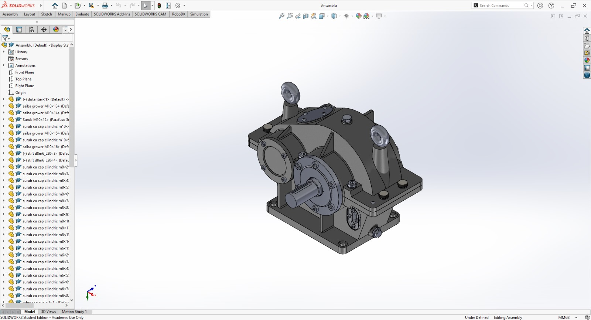
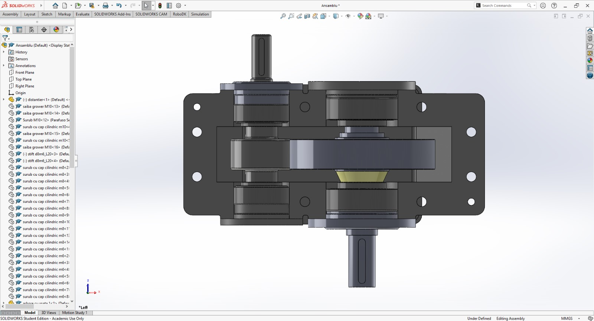
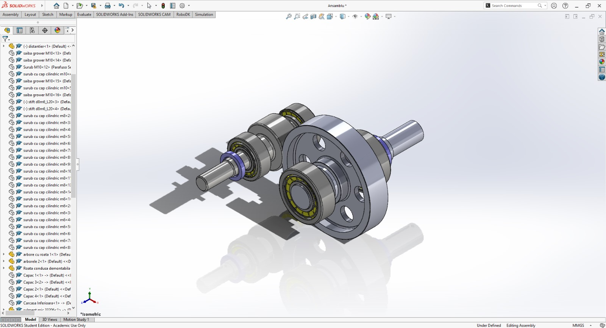
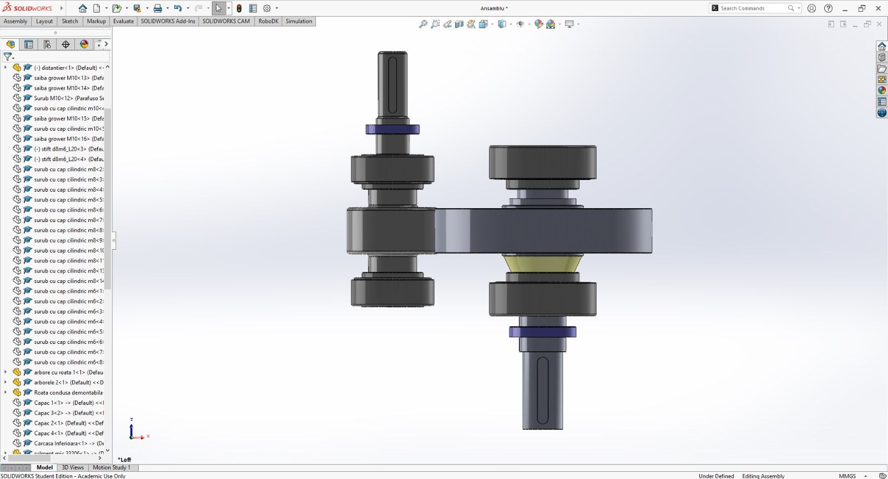

To open the main assembly in SOLIDWORKS 2024 clone the repository and open the Single-Stage-Reduction-Gearbox.SLDASM file from the "solidworks-files" directory.

### Image 1 - Whole Assembly

### Image 2 - Top View Without Lid

### Image 3 - Gear Transmission Assembly View

### Image 4 - Top View of Gear Transmission Assembly

Bill of materials:
| Position | Description                                               | Reference | Qty | Material   | Notes                           |
| -------- | --------------------------------------------------------- | --------- | --- | ---------- | ------------------------------- |
| 1        | Input shaft with pinion                                   |           | 1   | 42CrMo4    | To be designed and manufactured |
| 2        | Gear wheel                                                |           | 1   | 42CrMo4    | To be designed and manufactured |
| 3        | Output shaft                                              |           | 1   | 1C45       | To be designed and manufactured |
| 4        | Radial-axial roller bearings with conical rollers         | 33206     | 2   |            |                                 |
| 5        | Radial-axial roller bearings with conical rollers         | 32307     | 2   |            |                                 |
| 6        | Rotating seal for gearbox input                           |           | 1   |            |                                 |
| 7        | Rotating seal for gearbox output                          |           | 1   |            |                                 |
| 8        | Fixing cover with seal pocket   (with shaft passage)      |           | 1   | EN-GJL-300 | To be designed and manufactured |
| 9        | Fixing cover with seal pocket   (without shaft passage)   |           | 1   | EN-GJL-300 | To be designed and manufactured |
| 10       | Simple fixing cover (with shaft   passage)                |           | 1   | EN-GJL-300 | To be designed and manufactured |
| 11       | Simple fixing cover (without   shaft passage)             |           | 1   | EN-GJL-300 | To be designed and manufactured |
| 12       | Lower casing                                              |           | 1   | EN-GJL-300 | To be designed and manufactured |
| 13       | Upper casing                                              |           | 1   | EN-GJL-300 | To be designed and manufactured |
| 14       | Inspection cover                                          |           | 1   | EN-GJL-300 | To be designed and manufactured |
| 15       | Oil sight glass Type C                                    |           | 1   | Plastic    |                                 |
| 16       | Lifting eye M8                                            |           | 2   |            |                                 |
| 17       | Air vent                                                  |           | 1   |            |                                 |
| 18       | Drain plug                                                |           | 1   |            |                                 |
| 19      | Pin M8                                                    |           | 2   |            |                                 |
| 20      | Grower washer M10                                         |           | 8   |            |                                 |
| 21       | Hexagon head screw M10                                    |           | 4   |            |                                 |
| 22       | Cylindrical head screw M10                                |           | 4   |            |                                 |
| 23       | Cylindrical head screw M8                                 |           | 12  |            |                                 |
| 24       | Cylindrical head screw M6                                 |           | 8   |            |                                 |
| 25       | Cylindrical head screw M4                                 |           | 8   |            |                                 |

